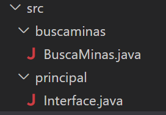

# Busca minas con dos capas
tienes orientaciones algorítmicas en el curso moodle

## Se pide:
- Nombre de proyecto: BuscaMinas
- Separar el interface de usuario de la lógica del juego.  Habrá dos paquetes. Uno se llamará principal y contiene la clase InterfaceConsola que contiene el main() . Otro se llamará buscaminas y contendrá la clase BuscaMinas que controlan la lógica del juego. 

- En la clase BuscaMinas todo private excepto lo que se requiera expresamente public. 
- Hay que cumplir en la clase BuscaMinas el principio de ocultación tanto para tipos primitivos como para referencias.
- generar javadoc para la clase BuscaMinas de forma que leyendo la ayuda de los métodos públicos otro programador pueda manejar tu clase sin leer el código java
- generar jar 
